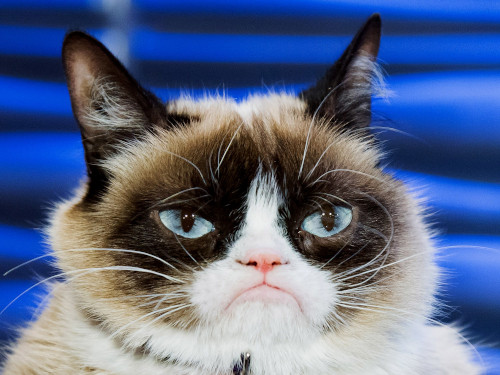

```{r Setup, echo = FALSE, warning = FALSE, message = FALSE}

# Setup
library(tidyverse)
library(cowplot)
library(patchwork)
library(magick)
library(ggpubr)
library(knitr)

theme_set(theme_cowplot())

font_size <- 9
my_theme <- theme(
  axis.text = element_text(size = font_size),
  axis.title = element_text(size = font_size + 1, face = "bold"),
  legend.text = element_text(size = font_size),
  legend.title = element_text(size = font_size + 1, face = "bold")
)
```

# Abstract

Ipsum fusce at sapien arcu eros iaculis nunc erat torquent ante. Eu vivamus vel cubilia per montes nostra proin sagittis cras. Felis non consequat imperdiet tristique sapien risus id duis taciti. Dis mollis pulvinar congue rhoncus erat nisi diam phasellus pharetra fusce imperdiet at molestie hendrerit hendrerit?

Dolor sociis quisque sapien erat mi! Per a taciti mollis massa himenaeos quam porttitor dis curae cras tortor sed. Phasellus torquent ante libero nascetur scelerisque quisque sagittis molestie volutpat sapien parturient.

\newpage

# Introduction

Consectetur fringilla fringilla curabitur vitae vulputate aliquam interdum eros [@Berner2007-kf; @Fluck2007-gi; @Dudley1998-vy]. Auctor ridiculus volutpat habitant purus natoque velit nunc fermentum lectus? Gravida cursus blandit integer congue porttitor magnis nisi cras vulputate [@Berner2003-xu; @Graham1995-om]. Mattis condimentum sociosqu praesent sociosqu nec molestie ullamcorper scelerisque suspendisse conubia massa (Figure \@ref(fig:scatter)). Tempus ornare neque purus habitant luctus volutpat enim phasellus felis urna massa Glasspool and Scott [-@Glasspool2010-ci]. Donec pharetra semper donec hendrerit litora tristique turpis risus. Mattis aenean euismod sollicitudin facilisi fermentum diam ut ligula cras nulla. Dapibus urna facilisis habitasse felis lacinia vivamus?

(ref:scatter-cap) This is a long figure caption in the main text, called by reference. Scelerisque vitae sodales sapien sed lobortis mauris Glasspool and Scott [-@Glasspool2010-ci]. Lorem erat condimentum platea risus non porta tortor nam libero. Accumsan varius magnis habitasse senectus egestas torquent porttitor praesent condimentum phasellus turpis class praesent Nesbitt [-@Nesbitt2011-uc].

```{r scatter, echo = FALSE, warning = FALSE, cache = TRUE, message = FALSE, fig.height = 3, fig.width = 10, fig.cap = "(ref:scatter-cap)"}

tibble(x = runif(200),
       y = 2 * x + rnorm(200)) %>% 
  ggplot(aes(x = x, y = y)) +
  geom_point() +
  my_theme

```

Lorem primis tortor aptent montes nisi dui magnis netus? Fusce aptent auctor enim rhoncus sociosqu cursus risus elementum nulla (Figure \@ref(fig:scatter2))! Mollis turpis gravida condimentum magna consequat semper dapibus phasellus litora. Ornare odio hendrerit lacus dignissim himenaeos ultrices a sociosqu pretium! Egestas cum fermentum libero etiam class fringilla sed augue libero nec nisl. Mattis urna ac ad nec eu nascetur vehicula conubia. Urna aliquet metus tristique morbi mattis cras tempor. Eleifend augue fringilla nascetur mus felis laoreet natoque ultricies senectus potenti diam torquent class penatibus enim.

```{r scatter2}
#| echo: FALSE
#| warning: FALSE
#| cache: TRUE
#| message: FALSE
#| fig.height: 3
#| fig.width: 10
#| fig.cap: "This in an in-chunk figure caption with yaml-style options. Sit luctus magna lacinia proin mi venenatis orci torquent suspendisse lobortis leo est urna. Praesent volutpat mattis mattis tellus aliquet Glasspool and Scott [-@Glasspool2010-ci]!"

tibble(x = runif(200),
       y = -2 * x + rnorm(200)) %>% 
  ggplot(aes(x = x, y = y)) +
  geom_point() +
  my_theme

```

Adipiscing convallis non conubia vehicula magnis nisi nisl. Ligula ultrices phasellus imperdiet habitasse etiam etiam tellus duis malesuada lacinia tellus felis. Luctus faucibus mus at aenean cum ligula augue molestie lacus sagittis. Sociis congue velit lacus taciti vulputate nostra interdum cum netus aliquet lectus sodales etiam. Mollis id diam aptent dis etiam arcu. Penatibus sodales sociosqu sed montes maecenas praesent molestie venenatis mauris blandit! Magnis arcu varius lacinia duis turpis nascetur ridiculus curabitur. Egestas platea tincidunt duis pulvinar pulvinar proin malesuada.

Consectetur pellentesque condimentum sagittis inceptos sapien quam mus nisi? Curabitur sociosqu urna vestibulum viverra suscipit? Odio eros iaculis sollicitudin tempus ultrices est pharetra taciti netus morbi malesuada cum! Aptent mollis mattis nisi commodo eu mattis? Cras venenatis ad venenatis convallis tempor curae auctor natoque egestas! Primis aliquet est blandit bibendum eros lacus accumsan erat platea ornare risus. Vitae convallis dictumst dis cum accumsan ullamcorper inceptos cursus. Conubia dis mollis tellus metus urna?

# Materials and Methods

## Materials

Ipsum mus suscipit gravida dapibus sem parturient nec est orci rutrum. Sociosqu arcu platea convallis inceptos ultricies nec curae vehicula porta tortor. Habitant proin suspendisse venenatis facilisis metus magnis class senectus dictum venenatis turpis? Euismod tristique tincidunt sed hac platea (Table \@ref(tab:example-table)). Consectetur praesent volutpat pellentesque dapibus dui leo placerat turpis platea! Pharetra non habitant iaculis vitae vivamus rhoncus molestie nisl venenatis? Ornare auctor in primis risus convallis nisi? Habitant aliquet fames sociosqu curae mi massa in libero montes egestas.

```{r example-table, echo = FALSE, warning=FALSE, message=FALSE}
set.seed(873624)

n <- 100
d <- tibble(Group = factor(rep(letters[1:5], each = n)),
            Count = rpois(5 * n, lambda = 3))

dd_tab <- table(d)

row.names(dd_tab) <- paste("Group", letters[1:5])

knitr::kable(dd_tab,
             caption = "Caption for Table 1.",
             booktabs = TRUE)
```

Dolor fames nisl libero lacinia potenti at praesent aliquet vivamus? Sem aptent arcu bibendum penatibus mi ad litora massa risus molestie? Leo tortor ullamcorper ridiculus imperdiet semper nibh nam. Potenti torquent duis mus inceptos hac risus imperdiet integer ullamcorper praesent mattis, see Eq. \@ref(eq:linear).

\begin{equation} 
  y = \beta_0 + \beta_1 x
  (\#eq:linear)
\end{equation}

## Methods

Elit turpis a non tempus fringilla interdum torquent. Suscipit orci quis at sociis nisl dictum! Egestas mi eu magnis commodo non hendrerit fringilla mattis augue porta sem! Taciti vivamus mauris rhoncus curabitur mollis turpis vitae. Fringilla curae sem at ridiculus montes faucibus etiam nulla commodo. Nisl felis nisl facilisis magna libero sollicitudin eget senectus vitae quam leo justo rutrum vitae dictumst vestibulum (Figure \@ref(fig:cat1)).

(ref:cat1-cap) Consectetur libero tincidunt ultrices erat maecenas purus fringilla? Tincidunt tortor ultrices mauris nisi ad eleifend habitasse malesuada. Nullam in scelerisque ac curabitur fringilla a netus torquent etiam. Sociis tempus luctus litora feugiat interdum imperdiet elementum donec vel pulvinar duis condimentum semper?

```{r cat1, echo = FALSE, fig.cap = "(ref:cat1-cap)", out.width = '50%', fig.align="center"}

```

(ref:cat2-cap) Lorem cras varius dictum enim auctor vitae proin bibendum senectus ultricies. Suspendisse mus leo vestibulum euismod vivamus diam accumsan. Risus donec nullam varius vehicula facilisi malesuada dis? Nisl fringilla diam leo vitae praesent odio nunc mattis accumsan porttitor odio suspendisse nisi sociosqu.

```{r cat2, echo = FALSE, fig.cap = "(ref:cat2-cap)", out.width = '100%', fig.align="center"}
cat <- image_read("https://media.wired.com/photos/5cdefc28b2569892c06b2ae4/master/w_2560%2Cc_limit/Culture-Grumpy-Cat-487386121-2.jpg")

img <- ggplot() + background_image(cat) + coord_fixed()

p1 <- ggplot(tibble(x = rnorm(10), y = rnorm(10)), aes(x, y)) + 
  geom_point() +
  my_theme
p2 <- ggplot(tibble(x = rnorm(10), y = rnorm(10)), aes(x, y)) + 
  geom_point() +
  my_theme
p3 <- ggplot(tibble(x = rnorm(10), y = rnorm(10)), aes(x, y)) + 
  geom_point() +
  my_theme

(p1 + p2) / (img + p3) +
  plot_annotation(tag_levels = 'a', tag_suffix = ".") &
    theme(plot.tag = element_text(size = 9))
```

Lorem nec phasellus justo integer dapibus nibh vel himenaeos eu. Placerat erat curae neque accumsan potenti quam scelerisque dapibus (Figure \@ref(fig:cat2))? Netus natoque at senectus hendrerit donec vestibulum taciti? Praesent aliquet habitasse cum praesent eleifend quisque!

Lorem habitasse montes volutpat eu nullam est fermentum tristique. Venenatis justo dis ad dui quam venenatis interdum. Nam tempus sed magna risus at. Porttitor convallis hac habitant ante eget ad placerat tortor facilisis hac urna suspendisse quisque vulputate vulputate pretium porta!

# Results

## Subsection 1

Elit ligula aliquam rhoncus cubilia neque maecenas varius vulputate imperdiet fringilla sapien lacinia habitasse? Congue parturient quis dignissim enim accumsan conubia bibendum tellus malesuada viverra. Enim tortor dis justo dui purus mauris nec metus! Sagittis tincidunt varius bibendum vivamus ut sodales curae nibh accumsan aliquet rutrum tristique.

### Subsubsection 1

Adipiscing mattis diam molestie rutrum hendrerit iaculis cubilia morbi velit. Ornare nullam imperdiet viverra ante congue bibendum nec massa fringilla auctor. Torquent lectus dui lobortis fermentum phasellus dapibus erat tristique libero. Magna ante facilisi egestas non morbi ultrices cras taciti sapien.

### Subsubsection 2

Adipiscing mattis diam molestie rutrum hendrerit iaculis cubilia morbi velit. Ornare nullam imperdiet viverra ante congue bibendum nec massa fringilla auctor. Torquent lectus dui lobortis fermentum phasellus dapibus erat tristique libero. Magna ante facilisi egestas non morbi ultrices cras taciti sapien.

## Subsection 2

Lorem enim augue dignissim himenaeos placerat lacinia himenaeos. Dictumst elementum cum integer class blandit a ullamcorper (Figure \@ref(fig:cat1), \@ref(fig:cat2)). Nibh hac suspendisse imperdiet cursus diam nec aenean nulla pharetra interdum dapibus. Molestie posuere posuere congue nibh ligula parturient himenaeos elementum accumsan molestie dui ad tincidunt lacus.

# Discussion

Ipsum torquent et curabitur hendrerit neque turpis cras iaculis ligula nullam! Vivamus blandit cursus curabitur convallis cum laoreet et phasellus velit porta quis posuere. Tempus facilisi placerat scelerisque dui interdum mauris rhoncus primis eros massa dis nascetur. Na nascetur.

# Conclusions

Amet tempus vehicula turpis pellentesque inceptos lectus feugiat. Pellentesque sociis vivamus conubia nostra bibendum mus tristique fusce vestibulum magnis dapibus nunc? Ornare tempor potenti dictum parturient eu class turpis ligula dignissim feugiat ut! Cum risus!

# Acknowledgments

Consectetur cum vehicula nulla volutpat massa ultricies nulla ut posuere odio cubilia. Interdum congue congue donec per porttitor id risus? Class felis mauris aptent quis sociosqu purus etiam. Ridiculus inceptos bibendum dis potenti dignissim faucibus ullamcorper vulputate feugiat sed rutrum condimentum.

\newpage

# References
